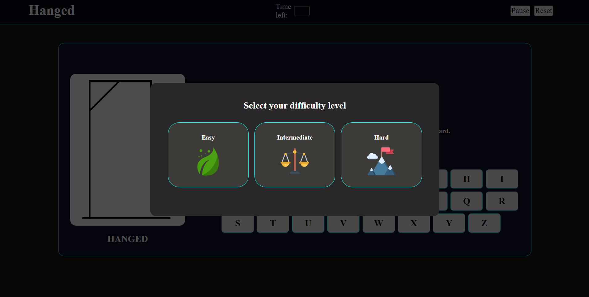
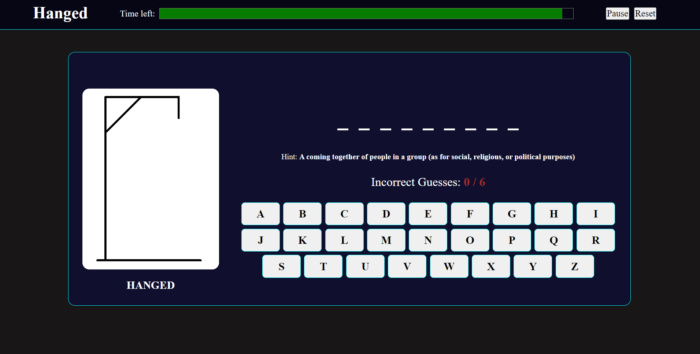
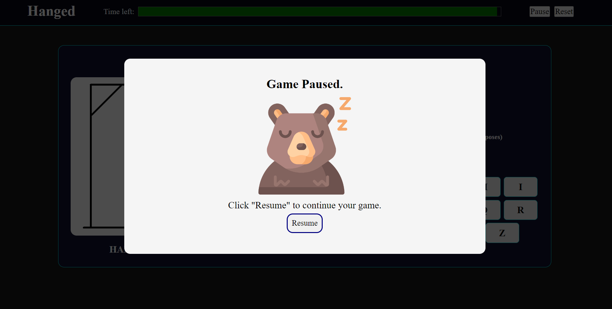
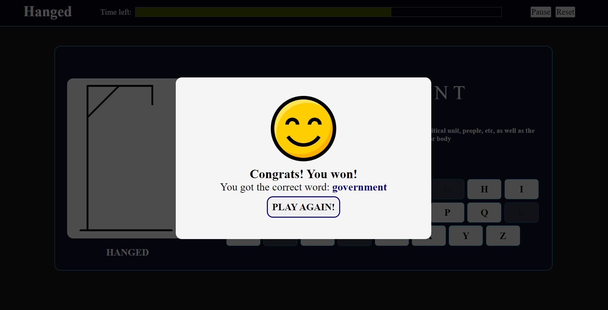
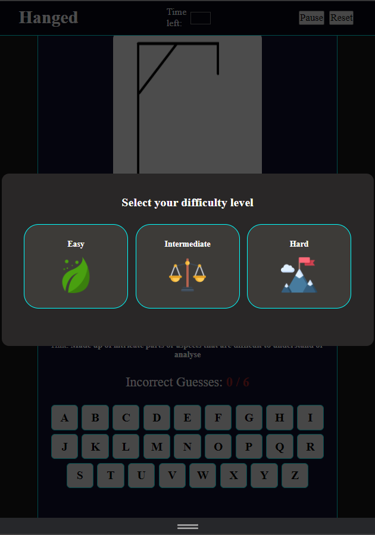
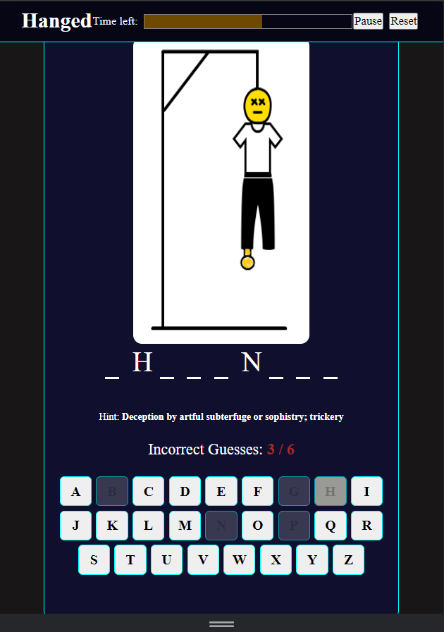
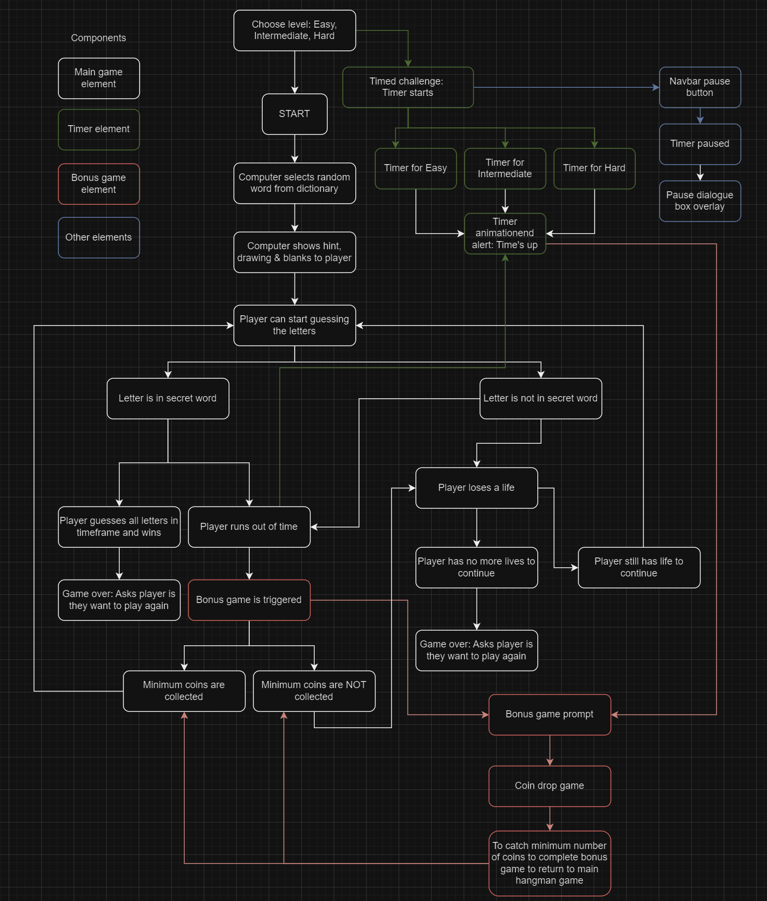
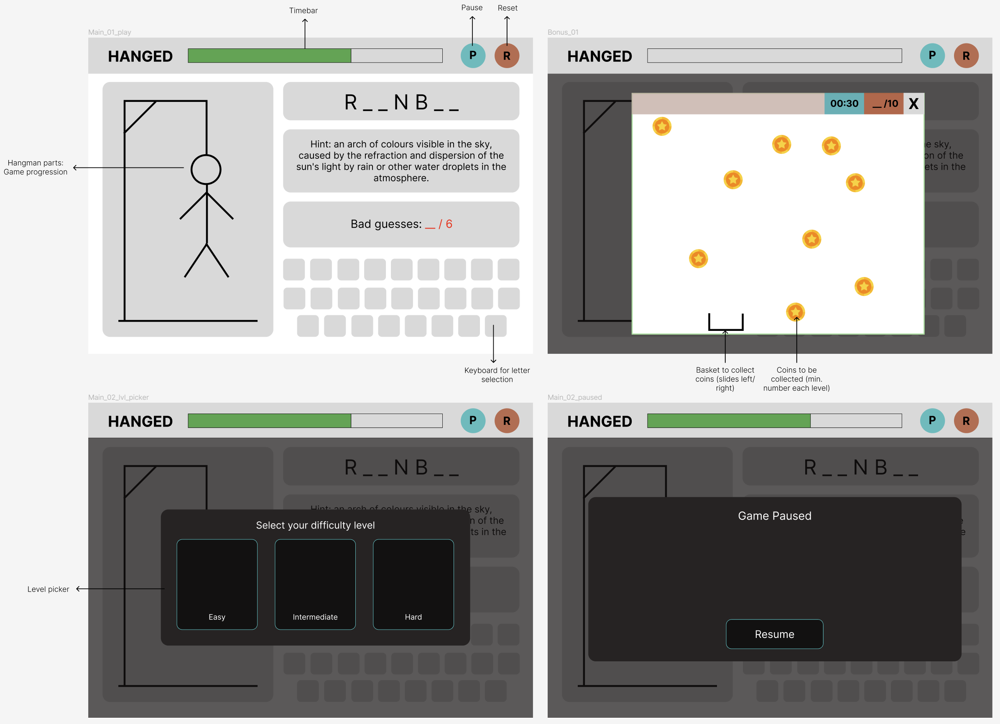
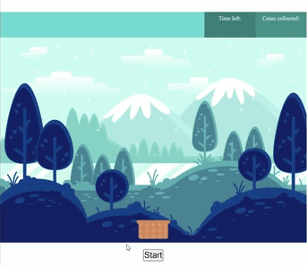

# ➰HANGED➰

This is an experimental game where the user competes against time to solve the hangman puzzle.  

**Unfinished:** Integrating additional pop-up bonus coin-drop portion. 

***

## Screenshots
#### Initial view - level picker

#### Game screen

#### Game paused

#### Game won/lost prompt 


#### Mobile view



***

## Technologies used 
* HTML
* CSS
* Javascript

***

## Getting Started
**How to play:** 
1. Select a level. 
2. Read the hint. 
3. Guess the letters present in the secret word. 
4. Aim to make less than 6 wrong guesses before the time runs out. 

[Play the game](https://llamaonthefence.github.io/llamaonthefence.github.io-hangedcoin/) 🎉

***

## Process
#### Game Logic (draw.io)


#### UI Sketch (Figma)


#### Favourites 
``` 
Handling cases with Switch Statement, alternatively to If/Else

const handleDifficultySelection = (difficulty,event) => {
    difficultyModal.classList.add("hide"); // closes difficulty selection dialogue box 

    let scriptEas, scriptInt, scriptHar; // declare the levels variables to access word-lists: 

    
    switch (difficulty) {
        case "easy": 
            scriptEas = document.createElement("script"); 
            scriptEas.src = "js/word-list-eas.js";
            scriptEas.onload = function() {
                getRandomWordEas(); 
                console.log(wordListEas); 
            }
            document.head.appendChild(scriptEas); 
            break; 
        
        case "intermediate": 
            scriptInt = document.createElement("script"); 
            scriptInt.src = "js/word-list-int.js";
            scriptInt.onload = function() {
                getRandomWord(); 
                console.log(wordListInt); 
            }
            document.head.appendChild(scriptInt); 
            break; 

        case "hard":
            scriptHar = document.createElement("script"); 
            scriptHar.src = "js/word-list-har.js";
            scriptHar.onload = function() {
                getRandomWordHar(); 
                //console.log(wordListHar);
            }
            document.head.appendChild(scriptHar);
            break; 

        default:
            scriptInt = document.createElement("script"); 
            scriptInt.src = "js/word-list-int.js";
            scriptInt.onload = function() {
                getRandomWord(); 
                console.log("Intermediate word list loaded"); 
            }
            document.head.appendChild(scriptInt); 
            break;
}};  

```
```
- Detecting collision from top of basket was problematic:
  Recalculated for collision detection between falling coins and full area of basket. 
- Basket kept going out of frame - infinite movement along x-axis: (Not in current code snippet)
  Top left hand anchor point required careful attention to calculation and visualising to get it right.

function detectCollision() {
    const basketTop = canvas.height - dHeight * 0.9; 
    const basketLeft = basketX - dWidth/2;   
    const basketRight = basketX + dWidth/2;   
    const basketBottom = canvas.height; 

    // iterate through generated coins in array
    for (let i=0; i < coins.length; i++) {
        const coin = coins[i]; 

        //collision logic
        if (coin.x >= basketLeft && coin.x <= basketRight && coin.y >= basketTop && coin.y <= basketBottom) {

        // check - y-coord of coin <= top edge of basket 
        //if (coin.y >= basketTop) {      
            // Collision action -> coin removal from canvas 
            coins.splice(i, 1); 
            // # of coins index reduces each time there's a collision 
            i--; 
            // update user score
            updateScore(); 
    }};

    // Check for minimum win criterium - coins captured
    if (startScore === 25 && timeLeft > 0 ) {
        // game win logic
        alert("Congrats! You've captured" + startScore + "coins to continue.")
        stopTimer();
        // disable button on the alert / click to go back to hangman game - incomplete
        } else if (startScore < 25 && timeLeft <= 0) {
            alert("Time's up! You lose."); 
            stopTimer();
            // disable button on the alert / click to go back to hangman game - incomplete
        };
};

```

***

## Challenges faced 
1. Integration of various components
2. Debugging e.g. in CSS, Javascript when files get larger
3. Unable to implement in the same window - layout constraint

***

## Possible improvements 
1. Game experience. It is not very fun now 
2. Better points system  
3. Hangman looping of array words doesn't repeat 

***

## Things I learned
1. Naming convention is important. Helps people to understand the codes
2. Investigate all console errors, not only the obviously "consequential" ones that are causing immediate errors
3. Break problem into small steps 
4. Pay attention to details as even a typo affects whether code runs
5. Growth mindset - ALL THE TIME 

***

## Next steps
1. Smoothen integration
2. Timer as limiting factor in game - complete as many words as possible in fixed time

**Below:** Coin drop pop-up game corresponding to 3 levels of Hanged - Created using Canvas (HTML/Javascript).



**Codes:**
* [Bonus Game #1 - Easy](https://github.com/llamaonthefence/Hanged/tree/48372aa9736cb615eeb2e7179ec80c571690061e/unit1_hw/tara/Homework/Unit_01/w06d1_project_01_game_04_bonus_eas)
* [Bonus Game #2 - Intermediate](https://github.com/llamaonthefence/Hanged/tree/48372aa9736cb615eeb2e7179ec80c571690061e/unit1_hw/tara/Homework/Unit_01/w06d2_project_01_game_05_bonus_int)
* [Bonus Game #3 - Hard](https://github.com/llamaonthefence/Hanged/tree/48372aa9736cb615eeb2e7179ec80c571690061e/unit1_hw/tara/Homework/Unit_01/w06d3_project_01_game_06_bonus_har)

***

## Attributions
* Icons - [Flaticon](https://www.flaticon.com/)
* Stock images - [Freepik](https://www.freepik.com/) 
* Various online dictionaries - [Merriam-Webster](https://www.merriam-webster.com/dictionary), [Dicitonary.com](https://www.dictionary.com/), [Cambridge Dictionary](https://dictionary.cambridge.org/dictionary/english)
* Emoji - [Emojipedia](https://emojipedia.org/curly-loop)
* GIF conversion - [Online Covert](https://www.online-convert.com/)
* Screen recorder - [ShareX](https://getsharex.com/)
* GIF edit - [EZgif](https://ezgif.com/)
* Video edit - [Videopad](https://www.nchsoftware.com/videopad/)
